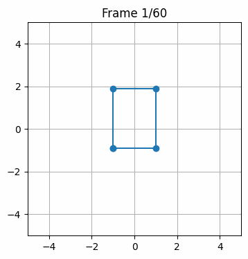

# Transformaciones

## Fecha
`2025-09-12`

---

## Objetivo del Taller

Explorar los conceptos fundamentales de transformaciones geométricas (traslación, rotación y escala) en distintos entornos de programación visual.
Crear un "Hola Mundo Visual" donde se muestre un objeto o escena básica y se le apliquen transformaciones estáticas y animadas en función del tiempo.

---

## Conceptos Aprendidos

Lista los principales conceptos aplicados:

- [ ] Transformaciones geométricas (escala, rotación, traslación)
- [ ] Segmentación de imágenes
- [ ] Shaders y efectos visuales
- [ ] Entrenamiento de modelos IA
- [ ] Comunicación por gestos o voz
- [ ] Otro: _______________________

---

## Herramientas y Entornos

- Python (matplotlib, numpy, imageio)
- Unity (versión LTS)
- Three.js / React Three Fiber
- Google Colab
- Processing (2D o 3D)

---

## Estructura del Proyecto

```
2025-09-10_taller_0_transformaciones/
├── python/               # Implementación con matplotlib y numpy
│   └── python.ipynb      # Notebook con matrices de transformación
├── unity/                # Proyecto Unity con transformaciones 3D
│   └── Assets/MoverObjeto.cs  # Script de movimiento y transformaciones
├── threejs/              # Aplicación React Three Fiber
│   └── src/components/Scene.jsx  # Componente con animaciones 3D
├── processing/           # Sketch con transformaciones 2D/3D
│   └── processing.pde    # Código principal con animaciones
├── gifs/                 # GIFs de resultados de cada entorno
│   ├── python.gif
│   ├── unity.gif
│   ├── threejs.gif
│   └── processing.gif
└── README.md
```

---

## Implementación

### Etapas realizadas
1. **Python**: Implementación de matrices de transformación homogéneas con matplotlib y numpy
2. **Unity**: Creación de script MoverObjeto.cs para transformaciones en tiempo real  
3. **Three.js**: Desarrollo de componente React con animaciones usando useFrame
4. **Processing**: Sketch con transformaciones 3D usando funciones nativas

### Metodología
Cada entorno aplica las tres transformaciones fundamentales:
- **Traslación**: Movimiento del objeto en el espacio
- **Rotación**: Giro sobre uno o múltiples ejes  
- **Escala**: Modificación del tamaño de forma dinámica

Todas las transformaciones están animadas en función del tiempo usando funciones trigonométricas (sin, cos) para crear movimientos suaves y cíclicos.

### Código relevante

**Python - Matrices de transformación homogéneas:**
```python
def apply_transform(points, M):
    P = np.hstack([points, np.ones((points.shape[0],1))])
    P2 = (M @ P.T).T
    return P2[:, :2]

# Matriz compuesta: escala -> rotación -> traslación
M = translation_matrix(tx, ty) @ rotation_matrix(theta) @ scale_matrix(sx, sy)
```

**Unity - Transformaciones en tiempo real:**
```csharp
void Update() {
    transform.Rotate(Vector3.up * rotationSpeed * Time.deltaTime);
    float scaleFactor = scaleBase + Mathf.Sin(Time.time) * scaleAmplitude;
    transform.localScale = new Vector3(scaleFactor, scaleFactor, scaleFactor);
}
```

**Three.js - Animaciones con useFrame:**
```javascript
useFrame((state) => {
    const t = state.clock.getElapsedTime()
    meshRef.current.rotation.x += 0.02
    const scale = 2 + Math.sin(t) * 0.3
    meshRef.current.scale.set(scale, scale, scale)
})
```

---

## Resultados Visuales

### GIFs animados de las transformaciones implementadas:

**Python - Matrices de transformación con matplotlib:**


**Unity - Transformaciones 3D en tiempo real:**


**Three.js - Animaciones con React Three Fiber:**


**Processing - Sketch 3D con transformaciones:**


Cada GIF demuestra las tres transformaciones fundamentales aplicadas de forma animada: traslación senoidal, rotación constante y escalado oscilante en función del tiempo.

---

## Prompts Usados

```text
"Cómo puedo implementar matrices de transformación homogéneas en Python para animar figuras 2D?"
"Cuál es la mejor manera de hacer que un objeto rote y se escale automáticamente en Unity usando scripts?"
"Cómo se anima un cubo 3D en Three.js con React Three Fiber usando el hook useFrame?"
"Qué funciones de Processing debo usar para aplicar transformaciones 3D a objetos geométricos?"
"Cómo puedo crear movimientos suaves y cíclicos usando funciones trigonométricas en animaciones?"
```

---

## Reflexión Final

Este taller permitió explorar las transformaciones geométricas fundamentales en cuatro entornos diferentes, cada uno con sus propias fortalezas. Python ofreció control preciso sobre las matrices de transformación y la capacidad de visualizar matemáticamente los cambios, mientras que Unity proporcionó un entorno 3D robusto para transformaciones en tiempo real. Three.js demostró ser excelente para web interactiva con React, y Processing ofreció simplicidad para prototipado rápido.

La parte más interesante fue observar cómo las mismas transformaciones matemáticas se expresan de manera diferente en cada entorno, pero producen resultados visuales similares. La implementación de matrices homogéneas en Python fue la más compleja conceptualmente, mientras que Unity y Processing abstraen estas operaciones en funciones más intuitivas.

Para futuros proyectos, aplicaría estas bases de transformaciones en animaciones más complejas, sistemas de partículas, y efectos visuales avanzados. La experiencia multi-entorno es sirve para elegir la herramienta adecuada según el contexto del proyecto.

---

## Checklist de Entrega

- [x] Carpeta `2025-09-10_taller_0_transformaciones`
- [x] Implementación en Python con matrices de transformación
- [x] Implementación en Unity con script MoverObjeto.cs
- [x] Implementación en Three.js con React Three Fiber
- [x] Implementación en Processing con transformaciones 3D
- [x] Código limpio y funcional en todos los entornos
- [x] GIFs incluidos para cada implementación
- [x] Transformaciones animadas en función del tiempo
- [x] README completo y claro
- [x] Commits descriptivos en inglés

---