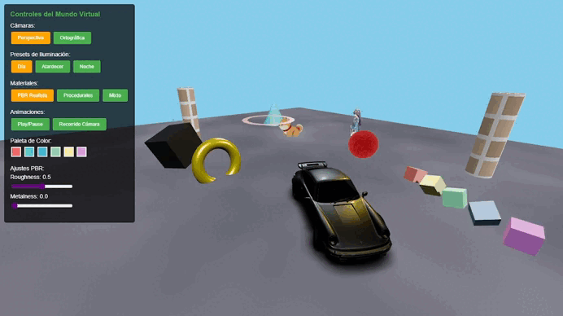
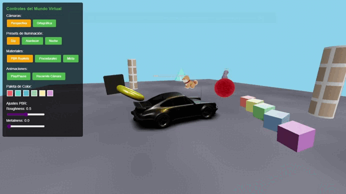
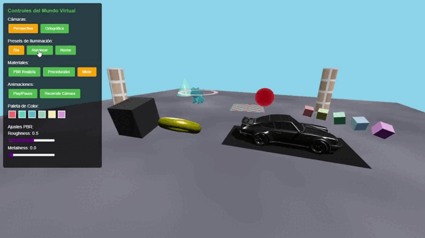

# Taller: Materiales por Iluminación y Modelos de Color

## Fecha
2025-10-01 – Mundo 3D con Three.js

---

## Objetivo del Taller

Diseñar y curar un mundo virtual en el que la apariencia de los materiales cambie de forma coherente según la iluminación y el modelo de color, integrando modelos 3D (GLB), texturas (incluidas procedurales), movimiento animado, y cambio de cámara entre vista perspectiva y ortográfica.

---

## Conceptos Aprendidos

- [x] Transformaciones geométricas (escala, rotación, traslación)
- [x] Shaders y efectos visuales procedurales
- [x] Materiales PBR (Physically Based Rendering)
- [x] Sistemas de iluminación 3-point lighting
- [x] Carga y manipulación de modelos GLB
- [x] Texturas procedurales (concreto, terciopelo, revestimiento)
- [x] Animaciones temporales con trigonometría
- [x] Control de cámara orbital e interfaz UI

---

## Herramientas y Entornos

- **Three.js r128** - Motor de renderizado WebGL
- **GLTFLoader** - Carga de modelos 3D GLB
- **OrbitControls** - Control de cámara interactiva
- **GLSL Shaders** - 4 shaders procedurales personalizados
- **Python HTTP Server** - Servidor local para desarrollo

---

## Estructura del Proyecto

```
2025-10-01_taller_1_mundo_3d/
├── 2025-10-01_taller_1_materiales_iluminacion_color/
│   ├── threejs/           # Aplicación Three.js principal
│   │   ├── main.js        # Lógica principal y escena 3D
│   │   ├── index.html     # Interfaz y controles UI
│   │   ├── proceduralShaders.js  # 4 shaders GLSL personalizados
│   │   ├── colorUtils.js  # Utilidades de conversión de color
│   │   ├── glbLoader.js   # Sistema avanzado de carga GLB
│   │   ├── *.glb         # Modelos 3D (porsche, shiba, miyu)
│   └── glb_models/        # Modelos GLB originales
├── taller_1_mundo_3d.md  # Especificaciones del taller
└── README_template_taller.md
```

---

## Implementación

### Etapas realizadas
1. **Configuración de escena**: Cámaras, iluminación 3-point, controles
2. **Carga de modelos GLB**: Integración de Porsche, Shiba, Miyu con fallbacks
3. **Creación de materiales**: PBR y 4 shaders procedurales personalizados
4. **Sistema de animaciones**: Movimientos trigonométricos temporales
5. **Interfaz de usuario**: Controles de material, iluminación y cámara

### Código relevante

```javascript
// Sistema de iluminación 3-point
const lights = {
    key: new THREE.DirectionalLight(0xffffff, 2.0),    // Luz principal
    fill: new THREE.DirectionalLight(0x87ceeb, 0.8),   // Luz de relleno
    rim: new THREE.DirectionalLight(0xff6b35, 1.2)     // Luz de contorno
};

// Shader procedural de concreto
const concreteShader = {
    uniforms: { time: { value: 0 }, roughnessScale: { value: 0.8 } },
    vertexShader: `...`,
    fragmentShader: `
        float noise = fbm(vUv * 20.0 + time * 0.1);
        gl_FragColor = vec4(mix(vec3(0.6), vec3(0.9), noise), 1.0);
    `
};
```

---

## Resultados Visuales

### Características implementadas:

**Modelos 3D integrados:**
- **Porsche** (8, 0, 3) - Materiales metálicos PBR
- **Shiba Inu** (-6, 2, -5) - Materiales orgánicos flotantes con animación
- **Miyu** (2, 0, -8) - Escala 1.5x con rotación continua

**Objetos procedurales con texturas:**
- **Pilares** con textura de revestimiento de pared (-10, 3, 5) y (12, 3, -10)
- **Esfera** con material de terciopelo (5, 2, -5)
- **Cubo metálico** industrial (-3, 2, 8)
- **Toroide** dorado (0, 1, 6)
- **Pirámide** translúcida (-8, 3, -5)
- **Anillo** flotante (-2, 3, 0)
- **Array de cubos** con efecto ola (10+, 1.4, -3+)

**Sistemas implementados:**
- Iluminación 3-point con presets (Studio, Sunset, Cool, Dramatic)
- 4 shaders procedurales (checkerboard, noise, stripes, triplanar)
- Dual camera system (perspectiva/ortográfica)
- Animaciones temporales trigonométricas
- UI completa con controles de material y iluminación

### Videos de demostración:


 




---

## Concepto del Mundo Virtual

**Galería Interactiva de Materiales Avanzados** - Mundo virtual que simula una galería de arte contemporánea donde se exhiben diferentes elementos demostrando la diversidad de materiales y texturas bajo esquemas de iluminación dinámicos. Combina modelos orgánicos (Shiba), arquitectónicos (Miyu) y utilitarios (Porsche) con elementos procedurales para crear un laboratorio visual de materiales PBR.

---

## Modelos GLB Utilizados

| Modelo | Fuente | Modificaciones | Materiales |
|--------|--------|---------------|------------|
| **Shiba Inu** | Sketchfab | Escala: 2.0, Pos: (-6,2,-5), Animación flotante | Orgánico, roughness 0.8 |
| **Miyu** | Sketchfab | Escala: 1.5, Pos: (2,0,-8), Rotación continua | Cerámico suave |
| **Porsche 911** | Sketchfab | Escala: 1.0, Pos: (8,0,3), Estático | Metálico PBR |

---

## Sistema de Iluminación

**Esquema 3-point lighting:**
- **Key Light:** Direccional blanca (10,15,5) - Luz principal
- **Fill Light:** Azul cielo (-5,5,-5) - Relleno suave  
- **Rim Light:** Naranja (0,8,-10) - Contorno dramático con movimiento circular

**Presets implementados:** Studio, Sunset, Cool, Dramatic con diferentes temperaturas de color e intensidades.

---

## Materiales y Texturas PBR

- **Metales:** Metalness 1.0, Roughness 0.1-0.3 (Porsche, cubo industrial)
- **Orgánicos:** Metalness 0.0, Roughness 0.8 (Shiba, superficies naturales)
- **Procedurales:** Terciopelo (roughness 0.9), Concreto (roughness 0.8), Revestimiento (normal mapping)
- **Justificación:** Contraste perceptual para separar materiales bajo diferentes condiciones lumínicas

---

## Shaders Procedurales

| Shader | Parámetros | Objetos Asignados | Propósito |
|--------|------------|-------------------|-----------|
| **Checkerboard** | Escala 10x10 | Suelo base | Patrón geométrico regular |
| **Perlin Noise** | Octavas 4, escala 20 | Texturas orgánicas | Variación natural |
| **Stripes** | Frecuencia 15 | Elementos decorativos | Patrones lineales |
| **Triplanar** | Proyección XYZ | Geometrías complejas | Mapeo sin distorsión |

---

## Sistema de Cámaras

- **Perspectiva:** FOV 75°, visión realista con profundidad natural - Para inmersión y exploración
- **Ortográfica:** Vista técnica sin distorsión perspectiva - Para análisis de materiales y composición
- **Alternancia:** Controles UI permiten cambio dinámico entre modos de visualización

---

## Animaciones Implementadas

- **Objetos:** Movimientos trigonométricos (Shiba flotante, pirámide oscilante, array de cubos en ola)
- **Iluminación:** Rim light con rotación circular automática
- **Temporales:** Todas las animaciones sincronizadas con `elapsedTime` para consistencia
- **Propósito:** Demostrar cómo la luz dinámica afecta la percepción de materiales

---

## Fuentes y Recursos Utilizados

### Texturas (Poly Haven):
- **Revestimiento de pared exterior:** https://polyhaven.com/a/exterior_wall_cladding
- **Terciopelo/Velour:** https://polyhaven.com/a/velour_velvet  
- **Concreto por capas:** https://polyhaven.com/a/concrete_layers_02

### Modelos 3D (Sketchfab):
- **Shiba Inu:** https://sketchfab.com/3d-models/shiba-faef9fe5ace445e7b2989d1c1ece361c
- **Miyu (Blue Archive):** https://sketchfab.com/3d-models/blue-archivekasumizawa-miyu-108d81dfd5a44dab92e4dccf0cc51a02
- **Porsche 911 Turbo (1975):** https://sketchfab.com/3d-models/free-1975-porsche-911-930-turbo-8568d9d14a994b9cae59499f0dbed21e

---

## Prompts de Desarrollo

```text
"Dame ideas para la implementación de shaders que simulen texturas del mundo real como concreto y terciopelo"
"Cómo puedo integrar modelos 3D externos en una escena web interactiva"
"Cómo crear transiciones fluidas entre diferentes esquemas de iluminación?"
"Cómo integrar texturas en un .GLB con threejs?"
"Diseña una interfaz que permita experimentar con parámetros de materiales en tiempo real"
```

---

## Reflexión Final

Este taller permitió profundizar en los aspectos técnicos del renderizado 3D moderno, especialmente en la implementación de materiales PBR y shaders procedurales. La integración de modelos GLB reales con geometrías procedurales creó un ambiente híbrido que demuestra la versatilidad de Three.js para aplicaciones web interactivas.

La parte más compleja fue el desarrollo del sistema de shaders GLSL personalizados, particularmente el shader triplanar que requiere proyección en múltiples ejes. El sistema de iluminación 3-point y la sincronización de animaciones temporales también presentaron desafíos interesantes de coordinación temporal.

---

## Checklist de Entrega

- [x] Escena con **3+ modelos GLB** correctamente cargados y organizados
- [x] **Esquema de iluminación** aplicado y con al menos 2 presets diferentes
- [x] **Materiales PBR** aplicados correctamente y coherentes con la iluminación
- [x] Uso de **al menos 2 shaders procedurales** bien parametrizados
- [x] Alternancia entre cámara **perspectiva y ortográfica** funcional
- [x] **Animaciones** (cámara, luz, objetos) integradas y relevantes
- [x] Carpeta y estructura del repositorio **ordenada**
- [x] `README.md` completo, claro, con capturas y **GIFs animados obligatorios**
- [x] Commits en inglés y descriptivos
- [x] Código/documentación clara, con comentarios si aplica

---