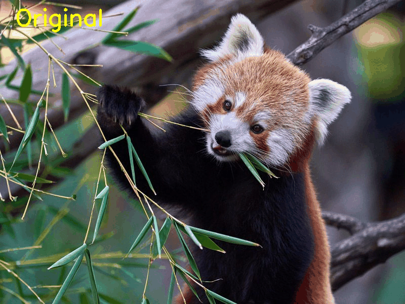
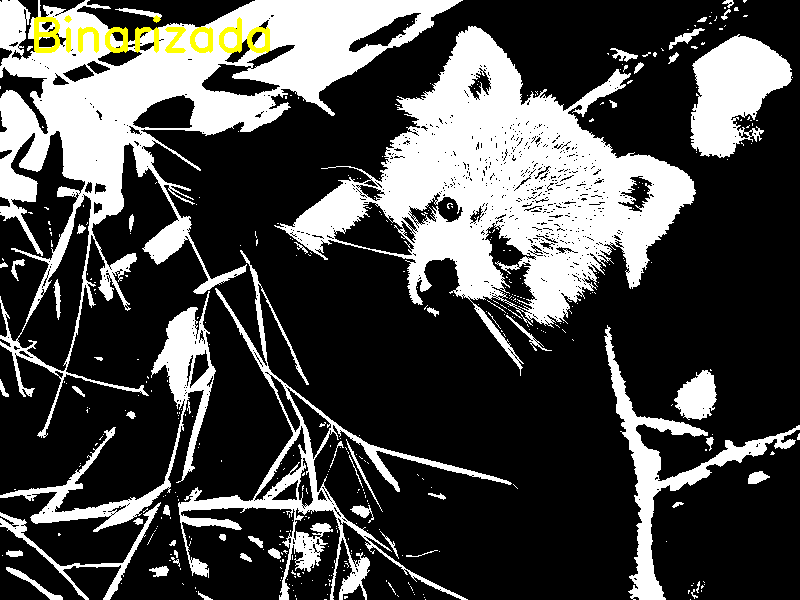
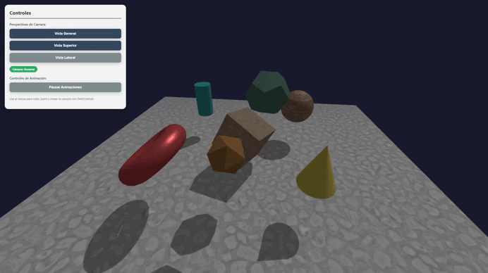
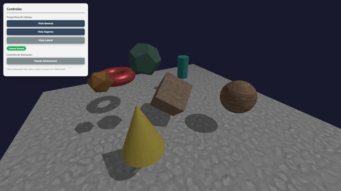
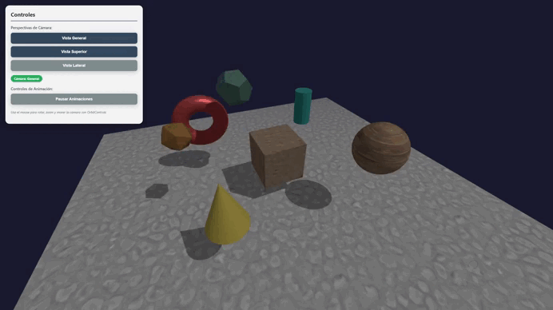

# Examen Final - Computacion Visual

**Nombre:** Deibyd Santiago Barragan Gaitan  
**Fecha:** Diciembre 3, 2025

---

## Punto 1 - Python

### Descripcion

Se implemento un sistema de procesamiento de imagenes utilizando Python y OpenCV sobre una imagen de un animal en via de extincion. Se aplicaron filtros de suavizado y realce de bordes, se separaron y visualizaron los canales RGB, se realizaron operaciones morfologicas (erosion y dilatacion) y se generaron animaciones en formato GIF mostrando las transformaciones aplicadas.

### GIFs



Este GIF muestra la secuencia completa del procesamiento de imagen, comenzando con la imagen original de un animal en via de extincion, seguida por la aplicacion del filtro de suavizado (Gaussian Blur), la deteccion de bordes usando el algoritmo Canny, la binarizacion de la imagen mediante el metodo de Otsu, y finalmente las operaciones morfologicas de erosion y dilatacion. Cada frame tiene una duracion de 1.5 segundos para permitir una visualizacion clara de cada transformacion.

La implementacion se realizo utilizando OpenCV para el procesamiento de imagenes y la biblioteca imageio para generar el GIF. Se crearon frames individuales para cada etapa del procesamiento, agregando texto descriptivo a cada imagen usando cv2.putText para identificar la transformacion aplicada, y se combinaron en un archivo GIF con una velocidad de 10 fps para una reproduccion fluida.


Este GIF alterna entre la imagen original y los dos filtros principales aplicados (suavizado y deteccion de bordes) en un ciclo de tres repeticiones. El filtro de suavizado reduce el ruido y los detalles finos mediante un kernel gaussiano de 15x15, mientras que la deteccion de bordes con Canny resalta los contornos y transiciones abruptas de intensidad con umbrales de 100 y 200.

La animacion se genero creando un bucle que alterna entre los tres estados (original, suavizado, bordes) con 10 frames de duracion para cada estado, permitiendo una comparacion visual clara del efecto de cada filtro. Esto facilita la comprension de como cada tecnica de procesamiento modifica las caracteristicas visuales de la imagen original.



Este GIF presenta la secuencia de operaciones morfologicas aplicadas sobre la imagen binarizada. Comienza con la imagen convertida a escala de grises y binarizada usando el metodo de Otsu, seguida por la erosion que reduce las regiones blancas usando un kernel de 5x5, y termina con la dilatacion que expande las regiones blancas con el mismo kernel estructurante.

Las operaciones morfologicas fueron implementadas utilizando las funciones cv2.erode y cv2.dilate de OpenCV, aplicando un elemento estructurante rectangular. La erosion adelgaza los bordes y elimina ruido pequeno, mientras que la dilatacion rellena huecos y conecta regiones cercanas. El GIF cicla tres veces a traves de estas transformaciones para demostrar claramente el efecto de cada operacion morfologica sobre la estructura de la imagen.

---

## Punto 2 - Three.js

### Descripcion

Se implemento una escena 3D interactiva con multiples formas geometricas basicas (cubo, esfera, toroide, cilindro, cono, dodecaedro, icosaedro y plano). La escena incluye tres perspectivas de camara diferentes con alternancia mediante botones, animaciones continuas para cada objeto, texturas aplicadas a diferentes geometrias, iluminacion con luces ambiental y direccional, y controles OrbitControls para navegacion completa.

### GIFs



Este GIF muestra la escena 3D completa con todas las formas geometricas en movimiento, incluyendo el cubo que rota continuamente, la esfera que rebota verticalmente, el toroide con rotacion compleja, el cilindro oscilante, el cono con escalado pulsante, el dodecaedro orbitando en circulo y el icosaedro girando. La escena esta iluminada con luz ambiental y direccional, proyectando sombras realistas sobre el piso texturizado.

La captura muestra diferentes angulos de la escena obtenidos mediante la rotacion de camara con OrbitControls, permitiendo apreciar la composicion tridimensional equilibrada y las texturas aplicadas a cada objeto. Las animaciones se ejecutan de forma continua en un bucle de renderizado que actualiza las posiciones, rotaciones y escalas de cada forma segun su tipo de animacion asignado.



Este GIF demuestra la funcionalidad de OrbitControls implementada en la escena, mostrando como el usuario puede rotar la camara alrededor del centro de la escena mediante arrastre con el boton izquierdo del mouse, hacer zoom acercando y alejando la vista con la rueda del mouse, y realizar paneo lateral con el boton derecho. Los controles tienen damping activado para proporcionar movimientos suavizados y una experiencia de navegacion mas fluida.

La implementacion de OrbitControls se realizo importando el modulo desde three/examples/jsm/controls/OrbitControls.js y configurandolo con limites de distancia minima (5 unidades) y maxima (30 unidades) para mantener la escena siempre visible. El damping factor de 0.05 proporciona una inercia natural a los movimientos de camara, y el angulo polar maximo esta limitado para evitar que la camara pase por debajo del piso.



Este GIF ilustra el sistema de multiples camaras implementado, alternando entre las tres perspectivas diferentes: vista general desde una posicion diagonal (8, 6, 8), vista superior desde arriba (0, 15, 0) y vista lateral desde el lado (15, 3, 0). Cada cambio de camara se realiza mediante botones en el panel de control, y un indicador visual muestra cual camara esta activa en cada momento.

El cambio de perspectiva se implemento creando tres objetos PerspectiveCamera con diferentes posiciones y angulos, todos apuntando al centro de la escena. La funcion switchCamera actualiza la referencia de currentCamera y reconecta los OrbitControls a la nueva camara activa, permitiendo que el usuario navegue desde cualquier perspectiva. Los botones del panel UI disparan eventos click que ejecutan esta funcion, proporcionando una transicion instantanea entre vistas.

### Implementacion

**Cambio de perspectiva:** Se crearon tres camaras PerspectiveCamera con posiciones estrategicas (vista general diagonal, vista superior cenital y vista lateral). El cambio entre camaras se implemento mediante una funcion switchCamera que actualiza la camara activa y reconecta los OrbitControls, permitiendo alternar entre perspectivas mediante botones en el panel de control con un indicador visual de la camara seleccionada.

**Animaciones:** Cada forma geometrica tiene asignada una animacion unica implementada en el bucle animate() usando requestAnimationFrame. Las animaciones incluyen rotacion continua (cubo, icosaedro), movimiento vertical sinusoidal (esfera, cilindro), rotacion en multiples ejes (toroide), escalado pulsante basado en funciones trigonometricas (cono) y movimiento orbital circular (dodecaedro). Todas las animaciones se calculan usando Date.now() para mantener velocidades consistentes independientes del framerate.

**Texturas:** Se implementaron texturas procedurales generadas mediante Canvas API, creando tres patrones diferentes: tablero de ajedrez (piso), cuadricula con lineas (cubo) y patron de puntos (esfera). Las texturas se configuraron con THREE.RepeatWrapping para permitir repeticion seamless y se aplicaron a los materiales MeshStandardMaterial mediante la propiedad map. Adicionalmente se cargaron texturas de archivos externos (roca, piedra apilada, madera) usando THREE.TextureLoader.

**OrbitControls:** Se implemento OrbitControls importando el modulo desde three/examples/jsm/controls/OrbitControls.js y vinculandolo a la camara activa y el elemento canvas del renderizador. Se configuro con enableDamping activado (factor 0.05) para movimientos suavizados, limites de distancia (min: 5, max: 30) para mantener visibilidad constante, y restriccion de angulo polar para evitar vistas desde debajo del piso. Los controles se actualizan en cada frame del bucle de animacion.

---

## Instrucciones de Ejecucion

### Python

1. Instalar dependencias:
   ```bash
   pip install opencv-python numpy matplotlib pillow imageio scipy
   ```

2. Colocar una imagen de un animal en via de extincion en `python/data/animal.jpg`

3. Ejecutar el notebook `python/examen_final_python.ipynb` en Jupyter Notebook o VS Code

### Three.js

1. Navegar a la carpeta del proyecto:
   ```bash
   cd examen_final/threejs
   ```

2. Instalar dependencias:
   ```bash
   npm install
   ```

3. Iniciar servidor de desarrollo:
   ```bash
   npm run dev
   ```

4. Abrir en el navegador: `http://localhost:3000`
